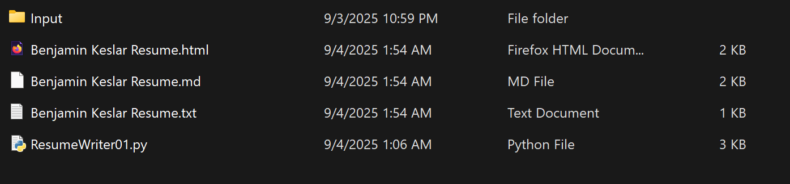

# How To Use My *Stupid* ResumeWriter Program

---

Hi, I made a program that assembles resumes from their individual components.  
It is *terrible, **barely works,*** and now I'm going to teach **you** how get **it** to output something approximating a usable resume.

### Setup

1. Download ResumeWriter.py
2. Create a directory titled "Input" in the same directory as ResumeWriter.py

3. Write individual resume sections as .txt files
	* Title one of these as "Preamble.txt"; this should contain your name and contact info, in that order, in neat lines
	* Every section heading should end with a colin (":"); the program will flag these as headings in HTML and Markdown
	* All of these files (except "Preamble.txt", which will be loaded first automatically) should be given a unique starting character
4. Place resume sections in the Input Directory

### Running The Progam

1. Run ResumeWriter.py

2. Respond to the first text prompt
	* This decides whether the output should be in the form of .txt, .md, or .html
	* All text prompts are responded to by typing the first letter of the desired option

3. Respond to the second text prompt
	* Order matters here
	* Any .txt not represented in the input will not be included
	* Options should be shown in the outputted list just above the input prompt; this lists the contents of the input directory

4. Minimize parser and look for your new resume
	* It should output to the same directory as ResumeWriter.py

### Damage Control

1. If the output is in .txt format, no edits needed
	* Questionable how useful a plaintext resume is though
2. If the output is in .html or .md format, open in text editor of your choice
	* You can add additional formatting through CSS
	* Most browsers can convert .html to .pdf, but that's not to say the results will be pretty
	* Certain things, like skills, may look better as lists rather than as paragraph text
3. You should now have something approximating a functional resume

